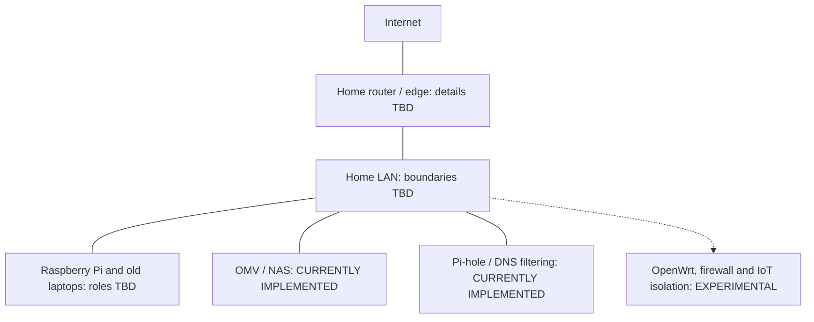

# Personal Home Lab

**Active / evolving**

I am a Computer Science student building a home lab with Raspberry Pi hardware, old laptops, and other repurposed equipment. I use it to learn Linux, networking, storage, DNS, and self-hosting. These notes are for my own reference and for other students and home-lab enthusiasts working with similar equipment.

## How it started

I started with a Raspberry Pi because I wanted to see what such a small computer could do. After discovering that I could host services locally, I wanted to use it for more than isolated experiments. Keeping private data and photos locally became one of the reasons to build out the lab.

From there, I started working with Linux, NAS storage, and DNS filtering. I also want to make the home network safer for family members who do not have a technical cybersecurity background. Firewall rules and IoT isolation are areas I am exploring toward that goal.

> Almost any piece of hardware capable of running software can be given a new purpose.

That is why repurposed hardware is part of this project. I want to see what I can do with equipment I already have.

## What is in the lab

| Component | Purpose | Status |
| --- | --- | --- |
| Raspberry Pi | Self-hosting and Linux | CURRENTLY IMPLEMENTED; model and service placement TBD |
| Linux | Operating systems and administration | CURRENTLY IMPLEMENTED; distributions and versions TBD |
| OpenMediaVault (OMV) | NAS / local storage | CURRENTLY IMPLEMENTED |
| Pi-hole | DNS-level filtering | CURRENTLY IMPLEMENTED |
| Old laptop(s) | Linux and kernel compatibility work | EXPERIMENTAL; hardware and final state TBD |
| Firewall rules and IoT isolation | Device access and network boundaries | EXPERIMENTAL; scope TBD |
| OpenWrt | Network and firewall exploration | EXPERIMENTAL; hardware, role, and features tried TBD |
| Arduino | Future IoT projects | PLANNED; model and availability TBD |

**CURRENTLY IMPLEMENTED** means in use, **EXPERIMENTAL** means an area of investigation or testing, and **PLANNED** means future work. **TBD** marks a detail I still need to add. Deployment status and the completeness of these notes are tracked separately.

I use **OMV** for the storage side of the lab and **Pi-hole** for DNS filtering. The [service inventory](docs/services.md) lists the configuration details I still need to document, including storage layout, backups, the DNS upstream, and client coverage.

## Component overview

This conceptual map groups the lab's hardware and services. Service placement, physical links, and current network boundaries are TBD.

The [architecture notes](docs/architecture.md) cover dependencies. A separate [planned diagram](diagrams/planned-architecture.md) shows the trusted, IoT, guest, and experimental networks I would like to explore.

## Working with an old laptop

One old laptop had trouble running even Linux distributions intended for older hardware. I started researching older Linux/Ubuntu kernel versions and experimenting with compatibility instead of setting the machine aside.

I still need to add the exact symptoms, versions, attempts, and final state to the [troubleshooting record](docs/troubleshooting.md).

## Next steps

- [ ] Fill in the hardware inventory and service-to-device mapping.
- [ ] Document the firewall and IoT-isolation experiments, including which OpenWrt features I have tried.
- [ ] Record the storage and backup setup, then plan a restoration test.
- [ ] Document which clients use Pi-hole and how they receive DNS settings.
- [ ] Recover the details of the laptop/kernel investigation.

VLANs, VPN access, monitoring, automated backups, additional services, and Arduino experiments are on the [longer-term roadmap](docs/roadmap.md). I also want to explore automation and how services on multiple machines depend on one another.

## DNS beyond the home network

Working with Pi-hole led me to questions about recursive resolvers, authoritative servers, root servers, and top-level domains. I can configure DNS inside my network, but those lookups depend on a much larger system outside it.

My [Internet infrastructure notes](docs/internet-infrastructure.md) collect the topics I want to study, including how Internet identifiers are coordinated and where ICANN fits into that work.

## Documentation

| Topic | Pages |
| --- | --- |
| Equipment and services | [Hardware](docs/hardware.md) · [Inventory](hardware/inventory.md) · [Services](docs/services.md) |
| Design | [Architecture](docs/architecture.md) · [Diagrams](diagrams/README.md) |
| Networking | [Networking](docs/networking.md) · [DNS](docs/dns.md) · [Security](docs/security.md) |
| Notes | [Troubleshooting](docs/troubleshooting.md) · [Experiments](notes/experiments.md) · [Lessons learned](notes/lessons-learned.md) |
| Learning and future work | [Learning](docs/learning.md) · [Internet infrastructure](docs/internet-infrastructure.md) · [Roadmap](docs/roadmap.md) |
| Repository upkeep | [Configuration notes](configs/README.md) · [Publishing checklist](docs/publishing-checklist.md) |

## Public documentation

Public diagrams and any configuration examples are sanitized for security; credentials and identifying network details stay private.

Corrections and suggestions are welcome through [CONTRIBUTING.md](CONTRIBUTING.md). Repository content is available under the [MIT License](LICENSE).
