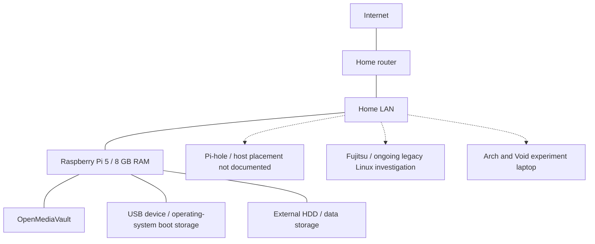

# Personal Home Lab

I am a Computer Science student running a small home lab around a Raspberry Pi 5 and repurposed computers. I use it for local storage, DNS filtering, and Linux experiments. These notes are for myself, other home-lab enthusiasts, and students starting with equipment they already have.

## Why I built it

I started with a Raspberry Pi because I wanted to understand what such a small computer could do. Discovering that services I normally used through external providers could run locally led me toward a personal-cloud environment for documents, photographs, and files used around the house.

That grew into working with networking, DNS, and security. I want the home infrastructure to be useful, eventually smarter, and safer for family members who do not have a technical cybersecurity background. Operating it myself gives me a reason to understand how its parts work.

> Almost any piece of hardware capable of doing useful computation or interfacing with another system deserves to be investigated before being discarded.

I have also disassembled another old computer and kept usable components for possible future projects.

## Current setup

| Component | Role | Status |
| --- | --- | --- |
| Raspberry Pi 5, 8 GB RAM | OpenMediaVault / NAS | Active |
| External HDD | Data storage for the Pi | Active |
| USB boot device | Operating-system storage for the Pi running OMV | Active |
| Pi-hole | DNS-level filtering; host placement not documented yet | Active |
| Fujitsu legacy laptop, less than 1 GB RAM | Older Ubuntu and kernel/hardware compatibility | Ongoing experiment; GUI issue unresolved |
| Arch/Void laptop | Linux distribution experimentation | Experimental |

Here, **Active** means in use, **Experimental/Ongoing** means investigation or testing, and **Planned** means future work.

## Current architecture

This is a conceptual component map. Connections show roles and relationships rather than cabling; dotted links leave device connectivity or service placement open.

The [architecture notes](docs/architecture.md) explain storage and service dependencies. OpenWrt is an area of exploration; its role as the home router is not established.

## Current investigations

- **Fujitsu laptop:** an old Ubuntu release is installed, but a graphical problem remains. I am investigating older kernels and hardware compatibility. [Case study](docs/troubleshooting.md)
- **Pi-hole and DNS:** I want to understand where local DNS control ends. The [DNS resolution experiment](experiments/dns-resolution-path.md) is planned and has not been run.
- **Networking and security:** I am exploring OpenWrt, firewall rules, and IoT isolation. Specific rules and outcomes are not documented yet. [Networking notes](docs/networking.md)

The [experiment index](notes/experiments.md) also links the Arch/Void exploration.

## Planned projects

- [homelab-status](projects/homelab-status.md): a Rust terminal tool for viewing information from several machines.
- Further OpenWrt work, network segmentation, and stronger isolation.
- Arduino/microcontroller experiments using retained components where feasible.
- Jetson Nano and local/private AI experiments, possibly a local voice assistant.
- Investigating reuse of an old DVD-player display.

The [roadmap](docs/roadmap.md) separates the next work from later ideas.

## What I am learning

Working with the Fujitsu made me notice how much I take modern memory and CPU resources for granted. It got me thinking more about resource-conscious software and kernel behavior.

On the Pi, I am learning by operating storage and thinking through its access and recovery needs. Pi-hole has led me toward [global DNS and Internet infrastructure](docs/internet-infrastructure.md). The planned Rust tool is a way to bring my interests in systems programming and administration into one project.

## Documentation

| Topic | Pages |
| --- | --- |
| Equipment and services | [Hardware](docs/hardware.md) · [Inventory](hardware/inventory.md) · [Services](docs/services.md) |
| Design | [Architecture](docs/architecture.md) · [Diagrams](diagrams/README.md) |
| Operations | [Networking](docs/networking.md) · [DNS](docs/dns.md) · [Security](docs/security.md) |
| Investigations | [Fujitsu](docs/troubleshooting.md) · [Arch/Void](docs/distribution-experiments.md) · [Experiment index](notes/experiments.md) |
| Learning | [Learning notes](docs/learning.md) · [Lessons learned](notes/lessons-learned.md) |
| Repository upkeep | [Configuration notes](configs/README.md) · [Publishing checklist](docs/publishing-checklist.md) |

## Public documentation

Public diagrams and configuration examples are sanitized for security; credentials and identifying network details stay private.

Corrections and suggestions are welcome through [CONTRIBUTING.md](CONTRIBUTING.md). Content is available under the [MIT License](LICENSE).
