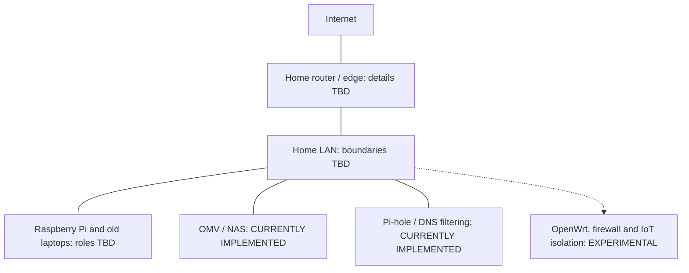

# Current component overview

[Home](../README.md) · [Architecture notes](../docs/architecture.md) · [Diagram guide](README.md)

This conceptual map groups the hardware and services. Physical links, host assignments, addressing, and network boundaries still need documenting.

Each box represents a component or area of work; service boxes may share hardware. Pi-hole's client coverage and OpenWrt's role are TBD. See the [service inventory](../docs/services.md) and the separate [planned network](planned-architecture.md).
