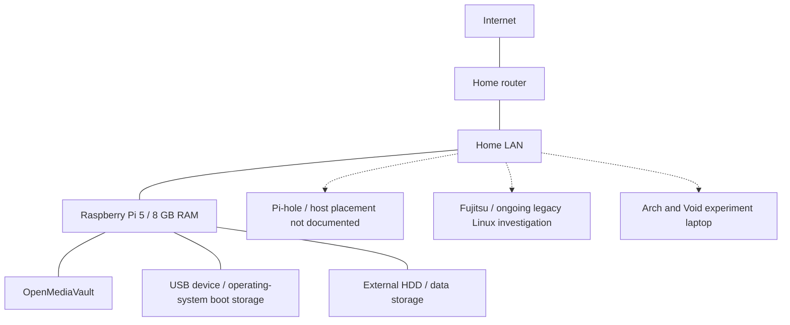

# Current architecture

[Home](../README.md) · [Architecture notes](../docs/architecture.md) · [Diagram guide](README.md)

Conceptual component map: OMV runs on the Raspberry Pi 5, with USB operating-system boot storage and an external data HDD. Pi-hole placement is not documented yet.

Lines show component relationships rather than physical cabling. Dotted links leave service placement or device connectivity open. The laptops represent separate investigations; Pi-hole's box represents a service whose host could be shared.

See the [planned network](planned-architecture.md) for future segmentation.
