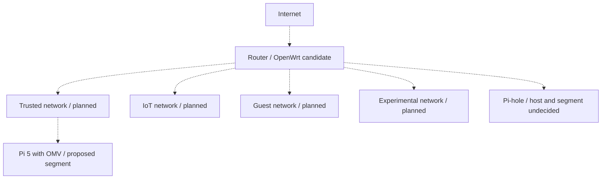

# Planned segmented network

[Home](../README.md) · [Architecture](../docs/architecture.md) · [Current components](current-architecture.md)

**Status: Planned.** I want to explore trusted, IoT, guest, and experimental networks. OpenWrt is a candidate for the edge role. OMV already runs on the Pi 5; its future segment is a design choice. Pi-hole's host placement remains undocumented.

All links are proposed relationships. Hardware VLAN support, interfaces, firewall zones, and access rules need working out. The design must specify which groups can query DNS, reach storage, and administer infrastructure.

VPN access, monitoring, and backup improvements remain on the [roadmap](../docs/roadmap.md).
