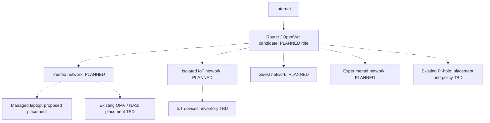

# Planned segmented network

[Home](../README.md) · [Architecture notes](../docs/architecture.md) · [Current components](current-architecture.md)

**PLANNED.** I want to explore separate trusted, IoT, guest, and experimental networks. OpenWrt is a candidate for the edge role. OMV and Pi-hole are already in use; their placement in this design is TBD.

Dotted links show proposed relationships. Hardware VLAN support, interfaces, firewall zones, and access policies need working out. In particular, I need to decide which groups can query DNS, reach storage, and administer infrastructure.

VPN access, monitoring, and backup improvements are also on the [roadmap](../docs/roadmap.md).
