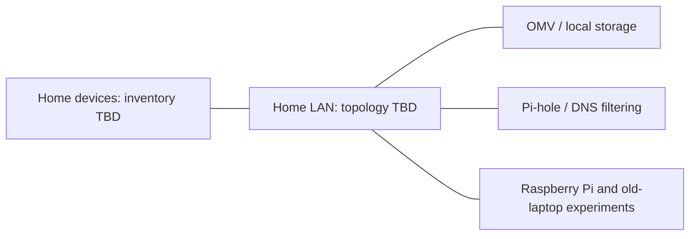
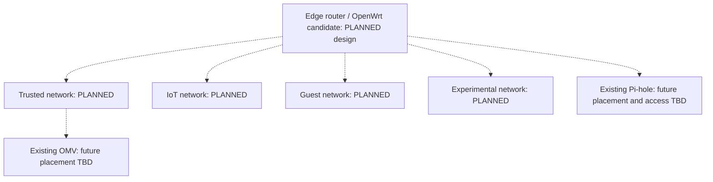

# Architecture

[Home](../README.md) · [Current diagram](../diagrams/current-architecture.md) · [Planned diagram](../diagrams/planned-architecture.md)

## Goals

I want to keep private data locally, run useful services, and understand how the machines supporting them interact. Raspberry Pi hardware and old laptops give me a starting point for that work.

## Current components

Raspberry Pi hardware, Linux, OMV/local storage, and Pi-hole/DNS filtering are **CURRENTLY IMPLEMENTED**. Old-laptop compatibility, OpenWrt, firewall rules, and IoT isolation are **EXPERIMENTAL**.

This component overview leaves physical placement open. Whether OMV and Pi-hole share a host, the device count, router platform, links, addressing, and storage layout still need documenting.

## Planned architecture — PLANNED

I want to separate personally managed devices from IoT, guest, and experimental devices, then define which services each group needs to reach.

Dotted links show proposed relationships. Hardware support, service placement, and access rules remain to be worked out. The logical groups could share physical equipment.

## Dependencies

| Component | Depends on | Details to add |
| --- | --- | --- |
| OMV/NAS | Host, disks, power, network, permissions | Host, layout, filesystem, and sharing protocol |
| Pi-hole | Host, client DNS settings, upstream resolution | Host, upstream, and client coverage |
| Home clients | Connectivity, addressing, DNS, routing | DHCP provider and router role |
| Future automation | Credentials, recoverable state, service dependencies | Tasks and tools; PLANNED |

A host failure can affect several services if they share that host. I need to record placement and observed failure behavior before deciding whether redundancy would help.

## Boundaries to document

The Internet edge and the boundaries between local devices have different roles. Current inbound exposure, device groups, and access policies are TBD.

For the segmentation experiments, I want to record who can reach storage, administer infrastructure, and use DNS. Each experiment should include expected allowed and denied traffic, observations, and a way to undo the change. Device trust depends on how it is managed and what access it needs; the network name alone does not enforce that policy.
