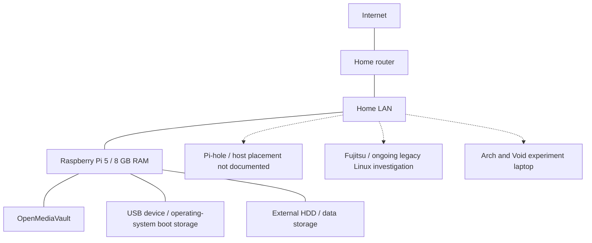

# Architecture

[Home](../README.md) · [Current diagram](../diagrams/current-architecture.md) · [Planned network](../diagrams/planned-architecture.md)

## Main system

OpenMediaVault runs on a **Raspberry Pi 5 with 8 GB RAM**. The Pi boots its operating system from a USB storage device and uses an external HDD for data. The system distribution/version and the detailed disk layout are not documented yet.

Pi-hole provides DNS-level filtering. Its host placement remains open in the component map. The Fujitsu and Arch/Void laptops are separate Linux investigations.

The diagram describes components and their roles. It leaves physical links and the laptops' current network connectivity unspecified. Pi-hole may share hardware with another service; its box identifies the service rather than an additional machine.

## Dependencies

| Component | Known relationship | Operational question |
| --- | --- | --- |
| OMV | Runs on the Pi 5 | How are access permissions, updates, and recovery handled? |
| USB boot device | Holds the Pi's operating system | How would I recover from a boot-device failure? |
| External HDD | Holds data used by the storage setup | What backup and restore arrangements exist? |
| Pi-hole | Provides DNS filtering | Which host, clients, and upstream resolver are involved? |
| Home clients | Use local connectivity, addressing, and DNS | Where are DHCP and DNS settings supplied? |

The boot device and data HDD have separate roles. That arrangement by itself is not a backup or a redundancy scheme. Backup configuration, filesystem, sharing protocol, encryption, and permissions are not documented yet.

## Network boundaries

I am exploring OpenWrt, firewall rules, and IoT isolation. The router platform, current access policies, and inbound exposure are not documented yet.

The [planned network](../diagrams/planned-architecture.md) separates trusted, IoT, guest, and experimental devices. VLAN support, interface assignments, and permitted traffic need investigation before implementing that design. Logical groups may share physical equipment.

For each boundary, I want to record which clients can query DNS, reach storage, and administer infrastructure, followed by allowed/denied traffic checks and rollback steps. Service placement and host failures also matter: services sharing a host can become unavailable together.
