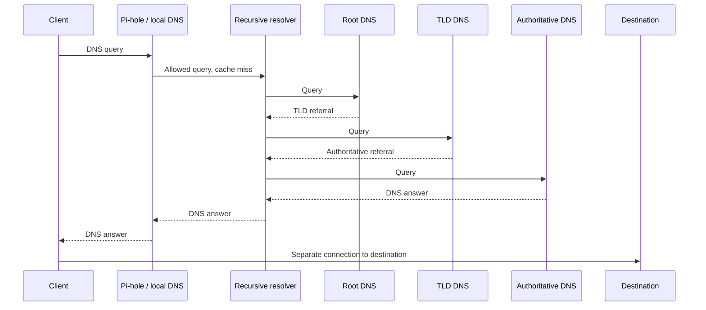

# DNS and Pi-hole

[Home](../README.md) · [Internet infrastructure](internet-infrastructure.md)

I use Pi-hole for DNS-level filtering. Host placement, version, upstream resolver, DHCP integration, local records, logging settings, and client coverage are not documented yet.

## Resolution and filtering

Pi-hole can block selected names. For allowed queries that cannot be answered locally or from cache, it can forward to a configured upstream resolver. Clients using another DNS path may bypass the local filter. See [Pi-hole's upstream documentation](https://docs.pi-hole.net/guides/dns/upstream-dns-providers/) and its [recursive-resolver explanation](https://docs.pi-hole.net/guides/unbound/).

Local DNS records name local services. A recursive resolver obtains answers for a client; authoritative servers publish answers for their zones. Root and TLD servers provide delegations that lead the resolver toward the relevant authoritative servers.

## Simplified lookup

This sequence illustrates an allowed lookup with cache misses. It is a reference for the planned experiment.

Cached answers and local records can skip stages; blocked queries stop earlier. The resolver follows referrals by querying each level. Aliases, retries, and validation are omitted here. The connection to the destination is separate from DNS resolution. See [Cloudflare's DNS explanation](https://www.cloudflare.com/learning/dns/what-is-dns/).

## Next experiment — planned

[From Pi-hole to the DNS Root: Where Does Local DNS Control End?](../experiments/dns-resolution-path.md) is the next planned DNS experiment. It compares the client's default resolver path, an explicit query to Pi-hole, an optional alternative resolver, and an iterative trace. An optional temporary denylist entry tests the local filtering boundary.

The experiment has **not been run yet**. DNSSEC authentication and encrypted DNS transport are separate topics for later study; their configuration in this lab is not documented yet.
