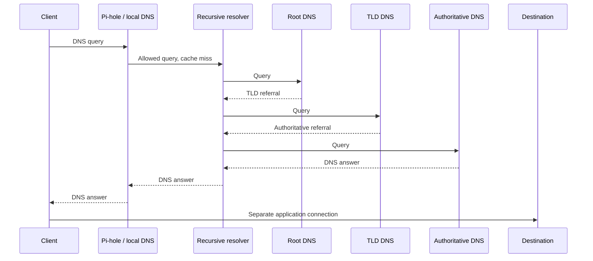

# DNS

[Home](../README.md) · [Internet infrastructure](internet-infrastructure.md)

## Pi-hole in the lab — CURRENTLY IMPLEMENTED

I use Pi-hole for DNS-level filtering as part of my work on the home network. It also led me to look beyond local settings and ask how DNS resolution works globally.

Version, upstream resolver, client coverage, query-log settings, DHCP integration, and local records still need documenting. Exploring local DNS, recursive resolution, and DNS security is **PLANNED**; a separate recursive resolver and DNSSEC setup remain TBD.

## Filtering and resolution

Pi-hole can block selected names. Clients that use another DNS path may bypass that filtering, and DNS filtering does not inspect all traffic.

For allowed queries that cannot be answered locally or from cache, Pi-hole can forward to a configured upstream resolver. See [Pi-hole's upstream documentation](https://docs.pi-hole.net/guides/dns/upstream-dns-providers/) and its [recursive-resolver explanation](https://docs.pi-hole.net/guides/unbound/).

Local records provide names for local services. A recursive resolver obtains answers for a client, while authoritative servers publish answers for their zones. Root and top-level-domain servers provide delegations that help the resolver find the relevant authoritative servers.

## Simplified lookup

This sequence shows an allowed, uncached query, followed by an application connection.

The resolver queries each level and follows referrals. Cached answers and local records can skip stages; blocked queries stop earlier. Aliases, retries, and validation are omitted here. The application connection runs between the client and destination, separately from DNS resolution. See [Cloudflare's DNS explanation](https://www.cloudflare.com/learning/dns/what-is-dns/).

## Experiments to try — PLANNED

- Check which clients query Pi-hole and how they receive DNS settings.
- Compare allowed, blocked, cached, and uncached lookups.
- Investigate a filtering decision that affects a service.
- Explore local service naming and recursive resolution.
- Compare what DNSSEC authenticates with what encrypted DNS transport protects.
- Observe how clients behave when DNS is unavailable.

I still need to collect observations for these questions.
