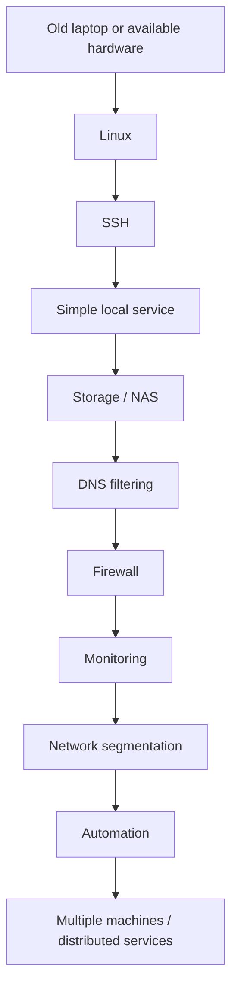

# Learning notes

[Home](../README.md) · [Lessons learned](../notes/lessons-learned.md)

I started by exploring what a Raspberry Pi could do, then moved into self-hosting, NAS storage, and DNS filtering. The old laptop led me into Linux/Ubuntu kernel compatibility. These are the starting points for the notes in this repository.

## Topics I want to connect

| Area | Question |
| --- | --- |
| Linux and systems programming | How do hardware support, operating-system behavior, and services interact? |
| Networking | How do DHCP, DNS, routing, and firewall rules affect access to a service? |
| Storage | How do permissions, filesystem behavior, and backups affect access and recovery? |
| Self-hosting and administration | What needs maintaining after a service is installed? |
| IoT and security | Which devices need to communicate, and how can that access be checked? |
| Automation — PLANNED | Which repeated tasks would benefit from a script and a recovery procedure? |
| Distributed services — PLANNED | What happens when services on different machines depend on each other? |

I want to use the lab to connect these topics with what I study in Computer Science. For troubleshooting notes, I will record the symptom, assumptions, software versions, changes, and observations. Differences between a guide's setup and my hardware belong in those notes too.

## Start small

My starting point was a Raspberry Pi. An old laptop is another possible starting point for someone with unused equipment.

This is a suggested progression for students; choose a step that answers a question you have:

## Troubleshooting questions

When a service is unreachable, I want to distinguish a stopped service from a DNS problem, missing route, or access rule. For a storage problem, the next questions might concern permissions or filesystem state. For services spread across machines, I want to understand which dependencies fail together.

The [experiment template](../notes/experiments.md) has space for the hypothesis, result, problems, and next attempt.
