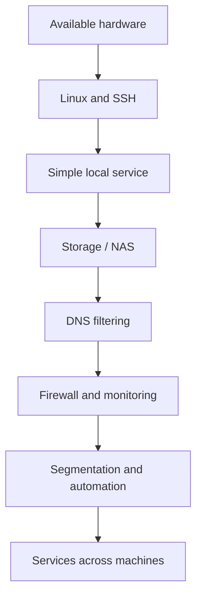

# Learning notes

[Home](../README.md) · [Lessons learned](../notes/lessons-learned.md)

## Operating the Pi

The Pi began as a small-computer experiment and now runs OMV. I want local storage for documents, photographs, and household files. That makes filesystem layout, access control, software updates, and recovery practical questions for the machine I operate.

## Working with limited resources

The Fujitsu has less than 1 GB RAM. Installing an old Ubuntu release left a GUI issue to investigate, and working with those limits made me think more about memory use, kernel components, and the assumptions software makes about hardware. The [case study](troubleshooting.md) records the current state.

## Trying different Linux systems

I installed/configured Arch and later began experimenting with Void on another laptop. The [distribution notes](distribution-experiments.md) separate that history from what I want to compare next.

## Connecting machines and services

Pi-hole led me to ask where local DNS filtering ends and global resolution begins. The [planned DNS experiment](../experiments/dns-resolution-path.md) gives that question a testable scope.

The planned [Rust status tool](../projects/homelab-status.md) connects systems programming, Linux administration, networking, and automation: collect useful information from several machines, handle partial failures, and display what is known without hiding errors.

## Starting small

For students starting with spare hardware, this is one possible progression. Choose a useful local task and expand as new questions arise.

For troubleshooting, separate a stopped service from a naming, routing, or permission problem. Record assumptions, versions, changes, and observations, including where a guide's setup differs from the hardware in front of you.
