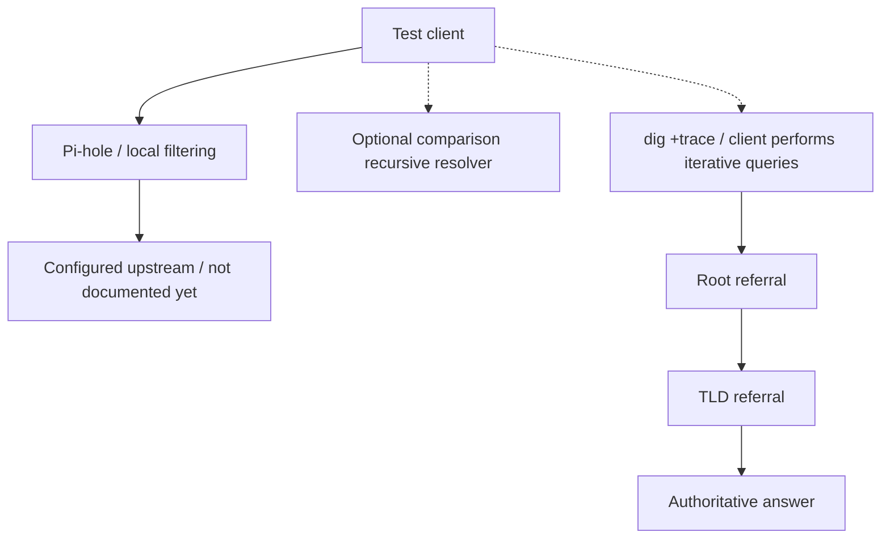

# From Pi-hole to the DNS Root: Where Does Local DNS Control End?

[Home](../README.md) · [DNS notes](../docs/dns.md) · [Internet infrastructure](../docs/internet-infrastructure.md)

**Status: PLANNED. Results: Not run yet.**

## Objective

When I block or resolve a domain through Pi-hole, where does my control stop and the wider DNS infrastructure begin? I want to compare queries through my normal resolver path, directly through Pi-hole, and along the DNS delegation hierarchy.

## Background

Pi-hole applies local filtering and can forward allowed queries to an upstream resolver. Recursive resolvers obtain answers using caches and, when needed, referrals through root and TLD servers to authoritative servers. Local filtering and authoritative zone contents are different layers.

`dig +trace` performs iterative lookups from the client. It is not a packet trace of Pi-hole's upstream activity. An explicit server with trace affects the initial root-server lookup, rather than making that server carry out the whole trace. See the [BIND dig manual](https://bind9.readthedocs.io/en/latest/manpages.html#dig-dns-lookup-utility).

## Hypothesis

If the test client's Pi-hole policy blocks `example.com`, an explicit query to Pi-hole should reflect that policy. A query to another reachable recursive resolver may still return an answer if the network permits that path. An iterative trace should expose delegation steps when direct DNS access is allowed. These are expectations to test.

## Topology

The client, Pi-hole host, upstream settings, and network policies must be recorded privately before the run. This is the proposed comparison, not an observed path:



The trace branch summarizes referral order; the client sends the queries at each stage. The root and TLD servers return referrals rather than forwarding the query down this chain.

## Prerequisites

- Use a client and Pi-hole instance I administer, with a working baseline and a way to restore any rule changed.
- Install or locate `dig`. `resolvectl` is useful only on a client using systemd-resolved; otherwise inspect that client's actual resolver configuration.
- Record the test date, client OS, `dig` version, Pi-hole version, active client/group policy, and DNS configuration. Keep identifying values in private notes.
- Privately identify Pi-hole's reachable address and, optionally, an approved comparison recursive resolver.
- Use `example.com`, reserved for examples; check whether it is already blocked or allowlisted and whether any local test depends on it. See [IANA example domains](https://www.iana.org/help/example-domains).
- Schedule the optional rule change so it does not interfere with anyone else's use. Prefer a rule scoped to the test client/group where supported.

## Commands

These commands are proposed steps. No output has been collected. Replace the quoted placeholders locally; they are not usable addresses.

### 1. Inspect the client's resolver setup

```sh
dig -v
resolvectl status
```

Run the second command only when systemd-resolved is in use; see the [resolvectl manual source](https://github.com/systemd/systemd/blob/main/man/resolvectl.xml). Its output can contain interface, domain, and resolver details. On another setup, inspect the network manager's DNS settings and `/etc/resolv.conf` locally instead. Record whether the configured resolver is a local stub and how its upstream is selected.

### 2. Establish baseline queries

```sh
PIHOLE_PRIVATE_IP='<PIHOLE_PRIVATE_IP>'
dig example.com A +time=3 +tries=1
dig @"$PIHOLE_PRIVATE_IP" example.com A +time=3 +tries=1
```

Keep the full local output so the response status, flags, answer, TTL, responding server, and timing can be compared. `dig` with no explicit server uses its configured resolver path, which can differ from browser DNS-over-HTTPS or other application-specific resolution.

Optional comparison, only if the selected resolver is reachable under the network's existing policy:

```sh
COMPARISON_RESOLVER='<COMPARISON_RESOLVER_ADDRESS>'
dig @"$COMPARISON_RESOLVER" example.com A +time=3 +tries=1
```

Do not change firewall policy to force this comparison to work. Record a timeout or refusal as an observation.

### 3. Follow delegation

```sh
dig +trace example.com A +time=3 +tries=1
```

Record the referrals and final response, or the stage at which the trace fails. Direct DNS queries can be blocked or intercepted; failure does not alone establish a global DNS problem. Trace output can contain public server addresses, so publish a summary using roles rather than raw output.

### 4. Optional temporary local filter

1. Record the existing exact-match deny/allow entries and test-client policy for `example.com`.
2. If a new isolated test is possible, add a temporary exact-domain deny entry through the installed Pi-hole interface. Record its scope. Leave unrelated lists and existing entries unchanged.
3. Repeat the two baseline queries and the optional comparison query with the same type and options.
4. If the result differs from the hypothesis, inspect the exact test query's policy decision locally, including group membership, allow rules, filtering state, and cache effects. Avoid collecting unrelated query history.
5. Remove only the temporary entry created for this experiment, restore any test-only group changes, and repeat the baseline queries.

A pre-existing rule should be left in its original state. If it prevents a clean temporary-rule test, skip that step and record the limitation.

## Expected observations

| Comparison | Expected or possible observation |
| --- | --- |
| Default versus explicit Pi-hole query | They may agree, or differ if the client's configured path is different. |
| Pi-hole with the temporary deny entry | A blocking response appropriate to its configured mode, rather than one assumed error code. |
| Comparison recursive resolver | May answer independently of the local rule, or be unreachable/subject to another policy. |
| Iterative trace | Referrals toward an authoritative answer, or a specific failure stage. |
| Query after cleanup | Baseline behavior should return; investigate remaining cache or policy differences if it does not. |

Pi-hole supports different [blocking modes](https://docs.pi-hole.net/ftldns/blockingmode/), so do not assume every block is NXDOMAIN. Cache state, TTLs, resolver policy, and answer variation can affect comparisons. Query timing alone is not a benchmark.

## Results

Not run yet.

## Interpretation before execution

A local denylist changes how selected clients receive answers through Pi-hole; it does not edit an authoritative zone or the global delegation system. A successful alternative lookup would show an available path for that client at that time, not establish every device's behavior. A failed alternative lookup requires investigation of the local path before assigning a cause.

The trace illustrates delegation. It does not identify Pi-hole's actual upstream behavior, reproduce its cache state, or by itself prove DNSSEC validation. The institutional coordination behind DNS also needs separate sources.

## Questions raised

- Which resolver path does this client actually use?
- Which filtering decisions are local, and which information comes from authoritative DNS?
- What does a referral tell me about responsibility for the next zone?
- Who coordinates the root, TLD delegations, and Internet identifiers?
- What happens when different paths provide different answers or fail?

## Rollback / cleanup

Restore the original denylist and test-client/group state, preserving any pre-existing rules. Repeat the baseline queries. If behavior has not recovered, investigate applicable cache TTLs and remaining policy differences before making further changes. Avoid restarting shared services or clearing network-wide caches just for this test.

Unset the temporary shell variables when finished. Review excerpts against the [publishing checklist](../docs/publishing-checklist.md); retain raw resolver settings and query output privately.
