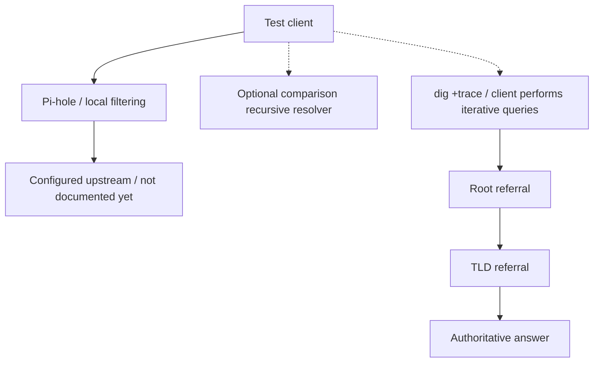

# From Pi-hole to the DNS Root: Where Does Local DNS Control End?

[Home](../README.md) · [DNS notes](../docs/dns.md) · [Internet infrastructure](../docs/internet-infrastructure.md)

**Status: PLANNED. Results: Not run yet.**

## Objective

When I block or resolve a domain through Pi-hole, where does my control stop and the wider DNS infrastructure begin? I want to compare my normal resolver path, a direct query to Pi-hole, and the DNS delegation hierarchy.

## Background

Pi-hole applies local filtering and can forward allowed queries to an upstream resolver. Recursive resolvers use caches and, when needed, follow root and TLD referrals to authoritative servers. A local denylist changes filtering, not the authoritative zone.

`dig +trace` performs iterative lookups from the client, not through Pi-hole's upstream path. With trace, an explicit server affects only the initial root-server lookup. See the [BIND dig manual](https://bind9.readthedocs.io/en/latest/manpages.html#dig-dns-lookup-utility).

## Hypothesis

A direct query to Pi-hole should reflect a denylist rule applied to the test client. Another recursive resolver may still answer if the network allows that path. An iterative trace should show delegations when direct DNS access is available.

## Topology

Paths to compare:



The trace branch shows referral order. The client queries each level; root and TLD servers return referrals rather than forwarding the query.

## Prerequisites

- A client and Pi-hole instance I administer, with `dig` available.
- Private notes on the test date, client OS, tool versions, DNS settings, and Pi-hole client/group policy.
- Pi-hole's address and, optionally, a comparison recursive resolver allowed by the existing network policy.
- A baseline check of `example.com`, a [reserved example domain](https://www.iana.org/help/example-domains), including existing deny/allow rules and any local use that could be affected.

## Commands

Replace the quoted address placeholders locally before running these steps.

### 1. Inspect the client's resolver setup

```sh
dig -v
resolvectl status
```

Use `resolvectl status` only with systemd-resolved; see its [manual source](https://github.com/systemd/systemd/blob/main/man/resolvectl.xml). Otherwise inspect the network manager's DNS settings and `/etc/resolv.conf`. Note whether a local stub is involved and how its upstream is selected.

### 2. Establish baseline queries

```sh
PIHOLE_PRIVATE_IP='<PIHOLE_PRIVATE_IP>'
dig example.com A +time=3 +tries=1
dig @"$PIHOLE_PRIVATE_IP" example.com A +time=3 +tries=1
```

Record the status, flags, answer, TTL, responding server, and timing. The default `dig` path can differ from browser DNS-over-HTTPS or other software's resolver settings.

Optional comparison:

```sh
COMPARISON_RESOLVER='<COMPARISON_RESOLVER_ADDRESS>'
dig @"$COMPARISON_RESOLVER" example.com A +time=3 +tries=1
```

Record timeouts or refusals rather than change firewall rules to force access.

### 3. Follow delegation

```sh
dig +trace example.com A +time=3 +tries=1
```

Record referrals and the final response, or where the trace fails. Local blocking or interception can affect this path. Summarize servers by role when publishing, since raw output includes addresses.

### 4. Optional temporary Pi-hole denylist test

1. Record the existing exact-match deny/allow rules and client/group settings for `example.com`.
2. Add a temporary exact-domain deny entry through Pi-hole's interface, preferably scoped to the test client/group. Leave existing entries unchanged; skip this step if they prevent a clean test or other users would be affected.
3. Repeat the baseline and optional comparison queries with the same options.
4. If behavior is unexpected, inspect the test query's policy decision, group membership, allow rules, filtering state, and cache effects locally.
5. Follow the cleanup steps below and repeat the baseline queries.

## Expected observations

| Comparison | Expected or possible observation |
| --- | --- |
| Default versus explicit Pi-hole query | Answers may differ if the client uses another resolver path. |
| Pi-hole with the temporary deny entry | A response matching its configured blocking mode. |
| Comparison recursive resolver | An answer independent of the local rule, or a connection/policy failure. |
| Iterative trace | Referrals toward an authoritative answer, or a failure at a particular stage. |
| After cleanup | Return to baseline behavior. |

Pi-hole's [blocking mode](https://docs.pi-hole.net/ftldns/blockingmode/) determines the response; a block is not always NXDOMAIN. Caches, TTLs, and resolver policies can affect answers and timings. This is a resolution-path test, not a benchmark.

## Results

Not run yet.

## Interpretation before execution

An alternative lookup could show a path around local filtering for the tested client. It would not change the authoritative data or establish how every device resolves names.

The trace shows delegation, not Pi-hole's upstream activity or cache state, and does not by itself prove DNSSEC validation. Understanding who coordinates the infrastructure also requires sources beyond the command output.

## Questions raised

- Which resolver path does this client actually use?
- Which filtering decisions are local, and which information comes from authoritative DNS?
- What does a referral tell me about responsibility for the next zone?
- Who coordinates the root, TLD delegations, and Internet identifiers?
- What happens when different paths provide different answers or fail?

## Rollback / cleanup

Remove only the deny entry added for this test and restore any test-only group changes. Preserve pre-existing rules, then repeat the baseline queries. If behavior differs, check cache TTLs and remaining policy differences; avoid restarting shared services or clearing network-wide caches for this test.

Unset the temporary shell variables. Keep raw settings and query output private, and check excerpts against the [publishing checklist](../docs/publishing-checklist.md).
