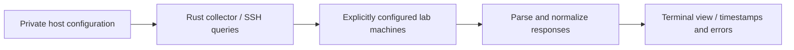

# homelab-status

[Home](../README.md) · [Roadmap](../docs/roadmap.md)

**Status: PLANNED — design only; implementation has not started.**

## Motivation

I want one terminal view of the machines in my home lab instead of checking each separately. Building it in Rust would connect my interests in Linux, systems programming, administration, networking, distributed machines, and automation.

## Minimum viable version

Start with one explicitly configured host and a manual refresh. Use SSH for a small set of read-only queries, normalize the responses, and print a terminal table. Begin with operating-system identity, kernel, uptime, and memory information. Add multiple hosts and a richer terminal interface after the collector handles failures clearly.

An SSH failure should show a specific state such as timeout, authentication failure, or host-key mismatch. “Offline” would be too strong a conclusion from a failed query alone. Previously collected values should be marked stale with their collection time.

## Possible architecture

A first implementation could invoke the local SSH client using explicit process arguments, fixed query strings, bounded output, and a timeout. This would avoid a custom daemon on each machine. The choice of Rust libraries and terminal UI framework remains open.

Keep transport, parsing, and presentation separate. Different machines can omit fields or use different service managers, so a failed or unsupported field should not discard the rest of a host's information. Limit concurrent queries and refresh frequency, especially for the Fujitsu.

## Data to collect

| Field | Proposed source or treatment |
| --- | --- |
| Machine label | Configured display label; actual hostname optional and kept local |
| Reachability | Last SSH-query outcome and timestamp, with separate failure reasons |
| Operating system | OS identification file where available; older systems may differ |
| Kernel | Kernel-release query |
| Uptime | Linux uptime information |
| RAM | Linux memory information with documented units and available/free distinctions |
| Disk use | Selected filesystem usage; distinguish capacity from mount/permission errors |
| CPU/load | Load averages first; CPU utilization would require interval-based sampling |
| Selected services | Explicit service allowlist and service-manager-specific queries |

Load average and CPU utilization describe different things. Service collection must account for systems such as Void using runit as well as other service managers. Availability on each actual machine needs checking during development.

## Security considerations

Use an unprivileged account and queries that work without sudo. Use the user's SSH agent/configuration rather than storing credentials in the project. Keep host-key verification enabled; require explicit resolution of a new or changed key.

Only contact configured hosts. Avoid accepting arbitrary remote commands, shell interpolation of labels or fields, or agent forwarding. Treat remote output as untrusted: bound its size, handle malformed input, and strip terminal control sequences before rendering. Keep private addresses, connection aliases, mount paths, and diagnostic output out of public examples.

There are no service-control, reboot, configuration-write, or automatic-discovery features in the MVP design.

## Development milestones — planned

- [ ] Define a small data model with optional values, timestamps, and error states.
- [ ] Build a read-only collector for one chosen host.
- [ ] Parse real outputs and test missing fields, malformed data, timeouts, and connection failures.
- [ ] Display one host in a terminal table.
- [ ] Add multiple configured hosts with bounded concurrency and per-host errors.
- [ ] Add selected disk and service information once the basic collection works.
- [ ] Document supported systems, queries, limitations, and local setup.

## Possible future improvements

A periodically refreshed terminal UI, local snapshots, configurable alert thresholds, and additional service-manager adapters. A remote agent could be reconsidered if SSH becomes limiting, after measuring that limitation. Historical charts and broader automation are later ideas.
